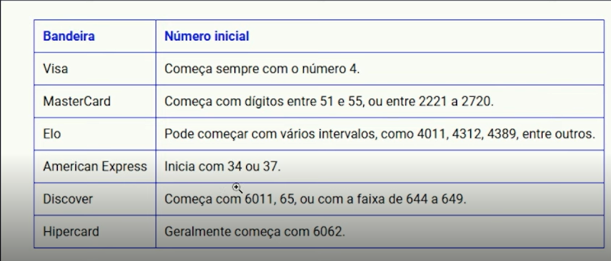

# **Desafio de Código: Validador de Bandeiras de Cartão de Crédito**

## **Descrição do Projeto**
Este projeto tem como objetivo desenvolver uma aplicação simples capaz de identificar a bandeira de um cartão de crédito (como Visa, MasterCard, etc.) com base no número do cartão. Utilizando o GitHub Copilot como assistente de codificação, exploramos como a inteligência artificial pode acelerar o desenvolvimento, sugerir trechos de código e melhorar a produtividade.

---

## **Objetivos de Aprendizagem**
Ao concluir este desafio, você será capaz de:
- Reproduzir e/ou melhorar um projeto com base em um código existente.
- Aplicar os conceitos aprendidos em um cenário real.
- Documentar seu raciocínio técnico e decisões de forma clara e organizada.
- Utilizar o GitHub como plataforma para versionamento e exposição do seu trabalho.

---

## **Passos para Conclusão do Desafio**
1. **Assistir às vídeo-aulas**  
   Não pule nenhuma etapa! As aulas contêm informações essenciais para o sucesso do seu projeto.

2. **Criar um repositório público no GitHub**  
   O repositório deve conter:
   - O código-fonte do seu projeto (recriado ou modificado).
   - Um arquivo `README.md` detalhado.
   - Qualquer outro arquivo relevante para a compreensão do projeto.
   - (Opcional) Capturas de tela relevantes organizadas em uma pasta `/images`.

3. **Entregar o projeto**  
   Envie o link do seu repositório e uma breve descrição clicando no botão “Entregar Projeto”.

---

## **Como Começar**
1. Faça um fork do repositório-base ou crie o seu próprio repositório.
2. Utilize o GitHub Copilot para auxiliar no desenvolvimento do código.
3. Documente todas as etapas do seu processo no arquivo `README.md`.

---

## **Sobre o Desafio**
Este desafio é uma oportunidade para você:
- Demonstrar suas habilidades técnicas.
- Construir um portfólio de destaque na DIO.
- Explorar como a inteligência artificial pode ser integrada ao desenvolvimento de software.

---

## **Entrega**
Certifique-se de que seu repositório contenha:
- Código funcional e bem documentado.
- Um README.md claro e organizado.
- (Opcional) Capturas de tela ou outros recursos visuais que ajudem na compreensão do projeto.

---

## **Padrões de Bandeiras**
Os padrões de números iniciais utilizados para identificar as bandeiras estão descritos na tabela abaixo:

---

## **Estrutura do Código**
### **Função `validarBandeiraCartao`**
- **Descrição**: Esta função recebe o número do cartão como entrada, valida-o utilizando o algoritmo de Luhn e identifica a bandeira correspondente com base em expressões regulares.
- **Objetivo**: Garantir que o número do cartão seja válido e determinar a bandeira correta.

---

**Boa sorte e sucesso no desafio!**